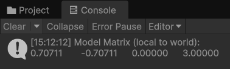
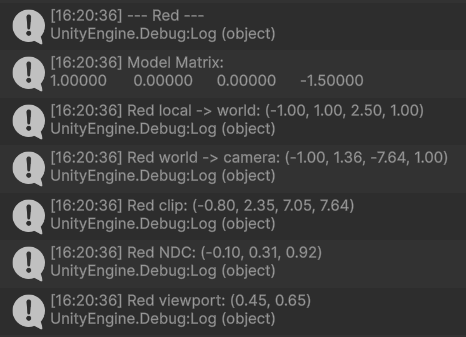
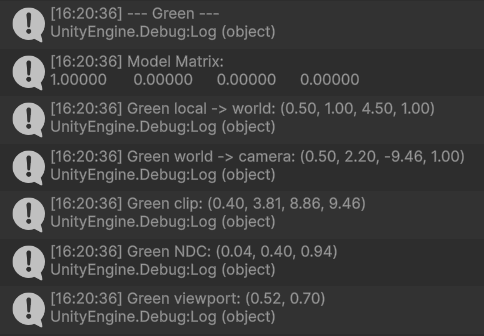
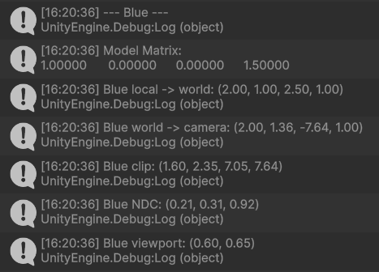

# Mundos virtuales. Introducción a la programación de gráficos 3D

## 15. ¿Cómo puedes calcular las coordenadas del sistema de referencia de un objeto con las siguientes propiedades del Transform?

**Transform:** Position = $(3, 1, 1)$, Rotation = $(45, 0, 45)$, Scale = $(1, 1, 1)$.

**Método usado:** en Unity se usa `Matrix4x4.TRS(position, Quaternion.Euler(...), scale)` para obtener la matriz modelo $(local → world)$. Unity aplica los eulers en orden $Z → X → Y$.



**Código usado:**

```csharp
Matrix4x4 model = Matrix4x4.TRS(new Vector3(3, 1, 1), Quaternion.Euler(45, 0, 45), Vector3.one);
Debug.Log(model);
```

---

## 16. Crea una escena en Unity con los siguientes elementos: cámara principal, plano base (como suelo) y tres cubos de distinto color (rojo, verde, azul) colocados en posiciones distintas en el espacio. Realiza un pequeño script de depuración adjunto a la cámara que permita visualizar en consola o en pantalla las matrices de transformación (Model, View, Projection) y sus resultados sobre un vértice de cada cubo.

**Script:** [`exercise_16.cs`](scripts/exercise_16.cs) imprime las matrices Model, View y Projection, y transforma un vértice local $(0.5, 0.5, 0.5)$ de cada cubo registrando $Local → World → Camera → Clip → NDC → Viewport$.

**Resultado en consola:**




