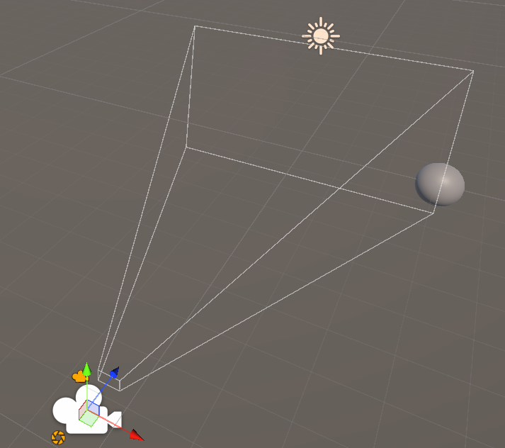

# Mundos virtuales. Introducción a la programación de gráficos 3D

## 1. ¿Qué funciones se pueden usar en los scripts de Unity para llevar a cabo traslaciones, rotaciones y escalados?.

En Unity, los objetos se manipulan principalmente a través de su componente Transform, que controla su posición, rotación y escala en el espacio.
Las funciones más comunes para realizar estos cambios desde los scripts son:

#### Traslación:
```csharp
transform.position permite asignar una posición absoluta al objeto.
transform.Translate(Vector3 desplazamiento, Space espacio) desplaza el objeto una cantidad determinada, pudiendo hacerlo en el sistema de coordenadas local (por defecto) o global.
```

#### Rotación:
```csharp
transform.rotation o transform.eulerAngles establecen una rotación absoluta.
transform.Rotate(x, y, z, Space espacio) aplica una rotación incremental.
```

#### Escalado:
```csharp
transform.localScale = new Vector3(x, y, z) modifica la escala del objeto en cada eje.
```

También pueden utilizarse funciones combinadas como transform.SetPositionAndRotation(pos, rot) para aplicar ambos cambios a la vez, o las versiones con física (Rigidbody.MovePosition y Rigidbody.MoveRotation) si se trabaja con objetos físicos.

---

## 2. ¿Cómo trasladarías la cámara 2 metros en cada uno de los ejes y luego la rotas 30º alrededor del eje Y?. Rota la cámara alrededor del eje Y 30ª y desplázala 2 metros en cada uno de los ejes. ¿Obtendrías el mismo resultado en ambos casos?. Justifica el resultado.

Para trasladar la cámara 2 metros en cada eje y luego rotarla 30° alrededor del eje Y, se puede hacer así:

```csharp
transform.Translate(new Vector3(2f, 2f, 2f), Space.World);
transform.Rotate(0f, 30f, 0f, Space.World);
```

En este caso, la cámara se mueve primero a la posición (2, 2, 2) y después se rota sobre su propio eje. La posición no cambia con la rotación, ya que esta se realiza sobre su punto de pivote.

Por otro lado, si primero se rota y luego se traslada en espacio local, el código sería:

```csharp
transform.Rotate(0f, 30f, 0f, Space.World);
transform.Translate(new Vector3(2f, 2f, 2f), Space.Self);
```

En este segundo caso, el desplazamiento se realiza en los ejes ya rotados de la cámara, por lo que la posición final no será la misma que antes. El orden de las operaciones sí afecta al resultado cuando se trabaja en coordenadas locales.
En cambio, si ambas traslaciones se hicieran en espacio mundial (Space.World), el resultado sería el mismo, ya que las coordenadas no dependen de la orientación del objeto.

En resumen, el resultado solo será igual si todas las operaciones se hacen en el espacio global. Cuando se usan ejes locales, el orden de aplicar la rotación y la traslación influye directamente en la posición final de la cámara, ya que la rotación modifica la orientación de los ejes de movimiento.

---

## 3. Sitúa la esfera de radio 1 en el campo de visión de la cámara y configura un volumen de vista que la recorte parcialmente.



---

## 4. Sitúa la esfera de radio 1 en el campo de visión de la cámara y configura el volumen de vista para que la deje fuera de la vista.


---

## 5. ¿Cómo puedes aumentar el ángulo de la cámara?. ¿Qué efecto tiene disminuir el ángulo de la cámara?

Puedes aumentar el ángulo de visión de la cámara modificando su propiedad Field of View (FOV), por ejemplo:

```csharp
Camera.main.fieldOfView += 5f;
```

Aumentar el FOV amplía el campo de visión, permitiendo ver una zona mayor de la escena, pero también genera una mayor distorsión: los objetos parecen más pequeños y las líneas cercanas a los bordes se curvan ligeramente generando el efecto “ojo de pez”.
Por el contrario, disminuir el ángulo reduce el campo de visión, lo que produce un efecto de zoom. Se observa una porción más pequeña del entorno, los objetos parecen más grandes y cercanos, y se reduce la sensación de profundidad.

---

## 15. ¿Cómo puedes calcular las coordenadas del sistema de referencia de un objeto con las siguientes propiedades del Transform?

**Transform:** Position = $(3, 1, 1)$, Rotation = $(45, 0, 45)$, Scale = $(1, 1, 1)$.

**Método usado:** en Unity se usa `Matrix4x4.TRS(position, Quaternion.Euler(...), scale)` para obtener la matriz modelo $(local → world)$. Unity aplica los eulers en orden $Z → X → Y$.


**Código usado:**

```csharp
Matrix4x4 model = Matrix4x4.TRS(new Vector3(3, 1, 1), Quaternion.Euler(45, 0, 45), Vector3.one);
Debug.Log(model);
```

---

## 16. Crea una escena en Unity con los siguientes elementos: cámara principal, plano base (como suelo) y tres cubos de distinto color (rojo, verde, azul) colocados en posiciones distintas en el espacio. Realiza un pequeño script de depuración adjunto a la cámara que permita visualizar en consola o en pantalla las matrices de transformación (Model, View, Projection) y sus resultados sobre un vértice de cada cubo.

**Script:** [`exercise_16.cs`](scripts/exercise_16.cs) imprime las matrices Model, View y Projection, y transforma un vértice local $(0.5, 0.5, 0.5)$ de cada cubo registrando $Local → World → Camera → Clip → NDC → Viewport$.

**Resultado en consola:**


---

## 17. Dibujar en un programa de dibujo el recorrido de las coordenadas de un vértice específico del cubo rojo. Indicar cómo cambia su valor en cada espacio. Aplicar la transformación manualmente a un punto (por ejemplo, el vértice $(0.5, 0.5, 0.5)$) y registrar los resultados paso a paso.

El Real Madrid recayó en los pecados cometidos en el Metropolitano. Ante un Liverpool intenso, organizado y bien armado cedió la segunda derrota de la temporada que no es grave a nivel estadístico, con la Champions encarrilada. Sí en lo anímico, de nuevo inferior en los duelos, en el juego aéreo, en la intensidad hasta el gol. No recibió una goleada porque Courtois ve una camiseta roja y se convierte en un gigante.

---

## 18. Mover o rotar uno de los cubos y mostrar cómo cambian los valores de su matriz de modelo. Rotar la cámara y mostrar cómo se modifica la matriz de vista. Cambiar entre proyección ortográfica y perspectiva y comparar las diferencias numéricas en la matriz de proyección.

**Script:** [`exercise_18.cs`](scripts/exercise_18.cs).

**Acciones realizadas en Unity:**

- Rotar `CubeRed` en +30° en Y.
- Mover cámara a $(0,1,-5)$ y rotar para mirar hacia los cubos.
- Alternar cámara entre Perspective y Orthographic.

**Resultados en consola:**


