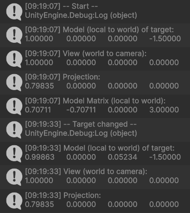
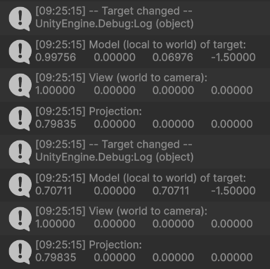

# Mundos virtuales. Introducción a la programación de gráficos 3D

## 15. ¿Cómo puedes calcular las coordenadas del sistema de referencia de un objeto con las siguientes propiedades del Transform?

**Transform:** Position = $(3, 1, 1)$, Rotation = $(45, 0, 45)$, Scale = $(1, 1, 1)$.

**Método usado:** en Unity se usa `Matrix4x4.TRS(position, Quaternion.Euler(...), scale)` para obtener la matriz modelo $(local → world)$. Unity aplica los eulers en orden $Z → X → Y$.


**Código usado:**

```csharp
Matrix4x4 model = Matrix4x4.TRS(new Vector3(3, 1, 1), Quaternion.Euler(45, 0, 45), Vector3.one);
Debug.Log(model);
```

---

## 16. Crea una escena en Unity con los siguientes elementos: cámara principal, plano base (como suelo) y tres cubos de distinto color (rojo, verde, azul) colocados en posiciones distintas en el espacio. Realiza un pequeño script de depuración adjunto a la cámara que permita visualizar en consola o en pantalla las matrices de transformación (Model, View, Projection) y sus resultados sobre un vértice de cada cubo.

**Script:** [`exercise_16.cs`](scripts/exercise_16.cs) imprime las matrices Model, View y Projection, y transforma un vértice local $(0.5, 0.5, 0.5)$ de cada cubo registrando $Local → World → Camera → Clip → NDC → Viewport$.

**Resultado en consola:**


---

## 17. Dibujar en un programa de dibujo el recorrido de las coordenadas de un vértice específico del cubo rojo. Indicar cómo cambia su valor en cada espacio. Aplicar la transformación manualmente a un punto (por ejemplo, el vértice $(0.5, 0.5, 0.5)$) y registrar los resultados paso a paso.

El Real Madrid recayó en los pecados cometidos en el Metropolitano. Ante un Liverpool intenso, organizado y bien armado cedió la segunda derrota de la temporada que no es grave a nivel estadístico, con la Champions encarrilada. Sí en lo anímico, de nuevo inferior en los duelos, en el juego aéreo, en la intensidad hasta el gol. No recibió una goleada porque Courtois ve una camiseta roja y se convierte en un gigante.

---

## 18. Mover o rotar uno de los cubos y mostrar cómo cambian los valores de su matriz de modelo. Rotar la cámara y mostrar cómo se modifica la matriz de vista. Cambiar entre proyección ortográfica y perspectiva y comparar las diferencias numéricas en la matriz de proyección.

**Script:** [`exercise_18.cs`](scripts/exercise_18.cs).

**Acciones realizadas en Unity:**

- Rotar `CubeRed` en +30° en Y.
- Mover cámara a $(0,1,-5)$ y rotar para mirar hacia los cubos.
- Alternar cámara entre Perspective y Orthographic.

**Resultados en consola:**



